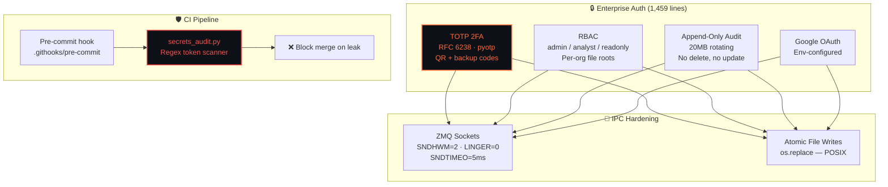

 

 

  

*Sole-authored by **[Ridhaant Ajoy Thackur](https://github.com/Ridhaant)** · Security layer for [AlgoStack](https://github.com/Ridhaant/AlgoStack)*

---

## ⚡ What Is SentinelVault?

The security perimeter for a **30,595-line production financial platform** — featuring a **1,459-line self-hosted enterprise authentication system** (TOTP 2FA, RBAC, multi-tenant, OAuth), CI-compatible secret scanning, append-only audit logging, and ZMQ socket hardening. **Zero hardcoded secrets** enforced across the entire codebase.

---

## 📊 Security Posture

| Layer | Implementation | Status |
|:---|:---|:---:|
| **TOTP 2FA** | RFC 6238, pyotp, QR enrolment, ±1 step, 8 bcrypt backup codes | ✅ PROD |
| **RBAC** | admin / analyst / client_readonly + filesystem-level tenant isolation | ✅ PROD |
| **Secrets** | Zero hardcoded across 30,595 lines — `.env` only, SecretManager | ✅ PROD |
| **Token Reset** | 48-char hex, 30-min expiry, one-time-use, replay-resistant | ✅ PROD |
| **Audit Trail** | 20MB rotating, append-only, immutable, tamper-evident | ✅ PROD |
| **CI Scanning** | `secrets_audit.py` — regex for tokens, keys, passwords | ✅ PROD |
| **Pre-commit** | `.githooks/pre-commit` runs scanner before every commit | ✅ PROD |
| **ZMQ Hardening** | SNDHWM=2, LINGER=0, SNDTIMEO=5ms — no DoS, no hang | ✅ PROD |
| **Atomic Writes** | write-to-.tmp + os.replace — zero partial-read corruption | ✅ PROD |

---

## 🏗️ Architecture

---

## 🔗 Proven in Production

Secures [AlgoStack](https://github.com/Ridhaant/AlgoStack) — a 30,595-line, 16-process live trading platform. Every auth event, every price write, every IPC message passes through SentinelVault's security controls.

---

## 📦 Related

---

© 2026 Ridhaant Ajoy Thackur · MIT License

